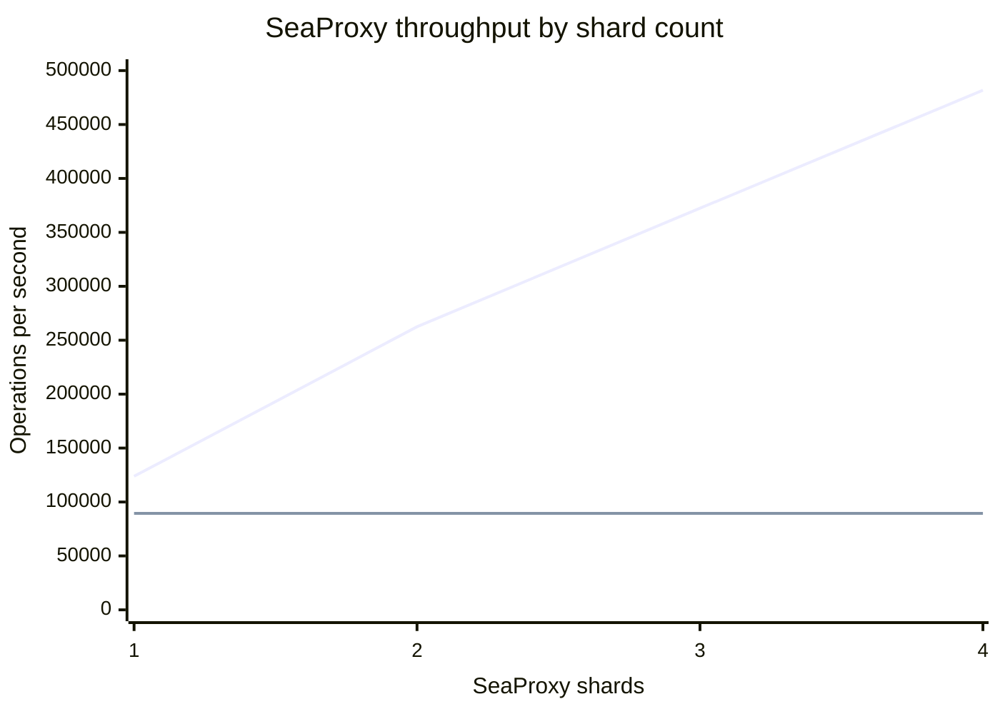
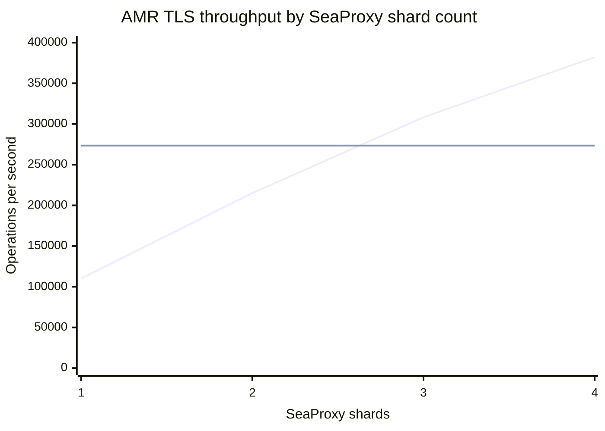

# SeaProxy Benchmarks

These benchmarks compare SeaProxy with direct Redis access for ordinary
multiplexed commands. Results were collected on October 1 and 2, 2026.

## Local Redis shard scaling results

The scaling benchmark used 800 concurrent go-redis workers, an 80% GET / 20%
SET workload, 10,000 keys, 128-byte values, and one backend Redis connection
per SeaProxy shard. SeaProxy and Redis ran on separate VMs.

| Target | Samples (ops/sec) | Mean | Relative to one shard | Scaling efficiency | Relative to direct Redis |
|---|---|---:|---:|---:|---:|
| Direct Redis using go-redis | 89,591; 89,481; 89,411 | **89,494** | - | - | 1.00x |
| SeaProxy, 1 shard | 124,218; 124,004; 123,312 | **123,845** | 1.00x | 100.0% | 1.38x |
| SeaProxy, 2 shards | 261,030; 262,472; 263,886 | **262,463** | 2.12x | 106.0% | 2.93x |
| SeaProxy, 3 shards | 372,006; 373,737; 371,373 | **372,372** | 3.01x | 100.2% | 4.16x |
| SeaProxy, 4 shards | 483,414; 486,621; 475,283 | **481,773** | 3.89x | 97.2% | 5.38x |

Graph series, in order: SeaProxy and direct Redis using go-redis.

## AMR TLS benchmark results

The AMR benchmark used an 80% GET / 20% SET workload, 10,000 keys,
128-byte values, and Private Link. All backend connections used TLS.

### Concurrency scaling

| Workers | Direct AMR using go-redis | SeaProxy, 4 shards, pool size 8 |
|---:|---:|---:|
| 50 | 137,384 ops/sec | 116,782 ops/sec |
| 100 | 196,498 ops/sec | 162,080 ops/sec |
| 200 | 241,129 ops/sec | 231,999 ops/sec |
| 400 | 270,326 ops/sec | 320,284 ops/sec |
| 800 | 271,725 ops/sec | 376,786 ops/sec |

### Shard scaling at 800 workers

Each SeaProxy shard used eight multiplexed connections per AMR primary. The
results are three 20-second samples after prepopulating the full keyspace.

| Target | Samples (ops/sec) | Mean | Relative to one shard | Scaling efficiency | Relative to direct AMR |
|---|---|---:|---:|---:|---:|
| Direct AMR using go-redis | 272,138; 271,663; 276,749 | **273,517** | - | - | 1.00x |
| SeaProxy, 1 shard | 109,601; 108,344; 111,934 | **109,960** | 1.00x | 100.0% | 0.40x |
| SeaProxy, 2 shards | 216,530; 214,199; 214,541 | **215,090** | 1.96x | 97.8% | 0.79x |
| SeaProxy, 3 shards | 307,151; 309,299; 308,277 | **308,242** | 2.80x | 93.4% | 1.13x |
| SeaProxy, 4 shards | 380,321; 382,837; 383,234 | **382,131** | 3.48x | 86.9% | 1.40x |

Graph series, in order: SeaProxy and direct AMR using go-redis.

## Local benchmark test environment

- Redis 7.0.15 ran on a separate 2-vCPU VM and was pinned to CPU 0.
- SeaProxy and the go-redis benchmark client ran on a 16-vCPU VM with eight
  physical cores and two hardware threads per core.
- SeaProxy Release build using Seastar 25.05.0 and the epoll reactor.
- SeaProxy used one to four shards on CPUs 0, 2, 4, and 6.
- The go-redis benchmark client used CPUs 8 through 15.
- SeaProxy and the benchmark client did not share physical cores.
- One multiplexed Redis connection per SeaProxy shard.
- Pipeline depth 64.
- Worker queue capacity 2048 per multiplexed connection.
- 800 concurrent go-redis workers.
- Three 20-second measured runs after a 10-second warm-up.
- The workload used 80% GET, 20% SET, 10,000 keys, and 128-byte values.
- Redis traffic used the VMs' private IP addresses.

SeaProxy was started through an outer `taskset` in addition to receiving its
Seastar `--cpuset` option. With `--overprovisioned`, the Seastar option alone
did not restrict every Linux thread in this environment.

All reported workloads completed with zero command errors and zero GET misses.